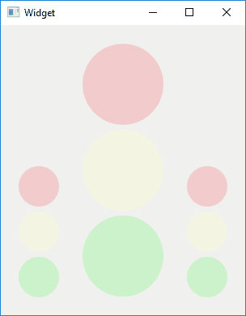

# qt-samosvet-mobile-app

The project is a part of the [SamoSvet](https://github.com/GRomR1/samosvet-project).
It developed to remote control a device (model of traffic light) by phone.

It uses an HTTP GET commands to change state of the device.

The UI is the simplest. I made it from scratch, so it's not great.

